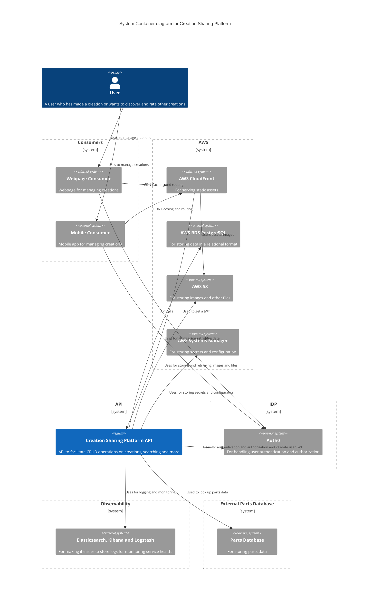

```mermaid
C4Context
    title System Container diagram for Creation Sharing Platform

    Person(user, "User", "A user who has made a creation or wants to discover and rate other creations")

    Boundary(b5, "Consumers") {
        System_Ext(ConsumerWeb, "Webpage Consumer", "Webpage for managing creations")
        System_Ext(ConsumerMobile, "Mobile Consumer", "Mobile app for managing creations")
    }
    Boundary(b1, "AWS") {
        System_Ext(CloudFront, "AWS CloudFront", "For serving static assets")
        System_Ext(RDS, "AWS RDS PostgreSQL", "For storing data in a relational format")
        System_Ext(BlobStorage, "AWS S3", "For storing images and other files")
        System_Ext(SystemsManager, "AWS Systems Manager", "For storing secrets and configuration")
    }
    Boundary(b0, "API") {
        System(SystemAPI, "Creation Sharing Platform API", "API to facilitate CRUD operations on creations, searching and more")
    }
    Boundary(b2, "IDP") {
        System_Ext(IdentityProvider, "Auth0", "For handling user authentication and authorization")
    }
    Boundary(b3, "Observability") {
        System_Ext(ELK, "Elasticsearch, Kibana and Logstash", "For making it easier to store logs for monitoring service health.")
    }
    Boundary(b4, "External Parts Database") {
        System_Ext(PartsDatabase, "Parts Database", "For storing parts data")
    }

    Rel(user, ConsumerWeb, "Uses to manage creations")
    Rel(user, ConsumerMobile, "Uses to manage creations")
    Rel(ConsumerWeb, CloudFront, "CDN Caching and routing")
    Rel(ConsumerWeb, IdentityProvider, "Used to get a JWT")
    Rel(ConsumerMobile, CloudFront, "CDN Caching and routing")
    Rel(ConsumerMobile, IdentityProvider, "Used to get a JWT")
    Rel(CloudFront, SystemAPI, "API calls")
    Rel(CloudFront, BlobStorage, "Static assets, images")
    Rel(SystemAPI, IdentityProvider, "Uses for authentication and authorization and validate user JWT")
    Rel(SystemAPI, RDS, "Uses for storing and retrieving data")
    Rel(SystemAPI, BlobStorage, "Uses for storing and retrieving images and files")
    Rel(SystemAPI, SystemsManager, "Uses for storing secrets and configuration")
    Rel(SystemAPI, ELK, "Uses for logging and monitoring")
    Rel(SystemAPI, PartsDatabase, "Used to look up parts data")
```
